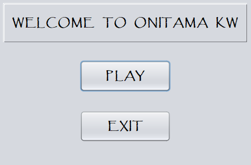
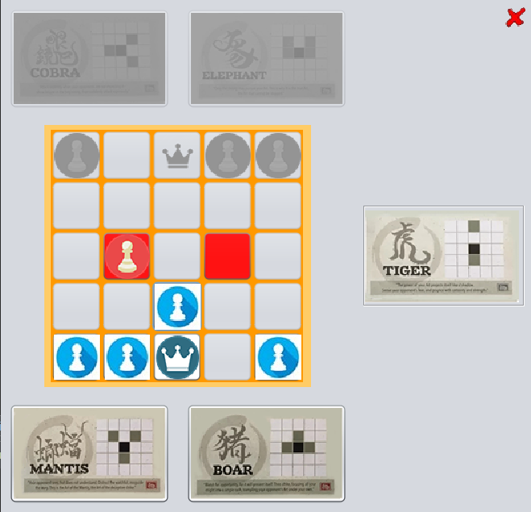
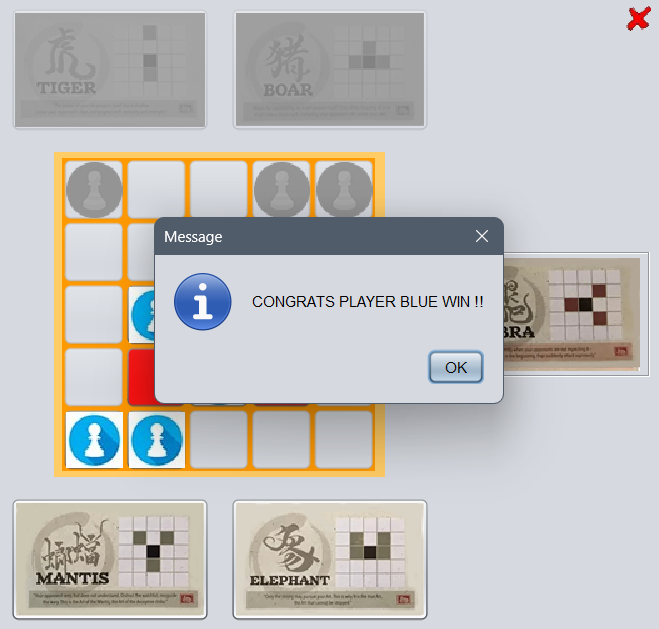

# 🐉 Onitama Java Game

This is a digital implementation of the **Onitama board game**, created as a team project during our Computer Science Bachelor's journey.  
We developed this project using **Java**, **Apache NetBeans**, and a **full form-based GUI**.  
We also implemented **SQL as a database** to store images and used **DAO (Data Access Object)** to load them into the game.

> 🎓 This project marks a big leap from our earlier solo projects, where we had just started learning data structures and object-oriented programming (OOP). Here, we brought our knowledge together and built something exciting as a duo!

---

## ✨ Features

- 🧠 Object-Oriented Design using Java
- 🖼️ GUI created with Java Swing in Apache NetBeans (no terminal!)
- 🗃️ SQL database integration for image storage and retrieval
- 🧩 DAO pattern for image access and game logic separation
- 🧵 Movement history stored using `ArrayList`
- 🔘 Custom buttons created by extending `JButton`
- 🃏 Onitama mechanics with card movement logic
- 📷 Screenshot available in `/assets` folder

---

## 👥 Team

- 💻 Developed by **Theo** and a friend  
- 🤝 Built together as part of our collaborative learning in university

---

## 🧰 Tech Stack

- **Java** – Main programming language  
- **Apache NetBeans** – IDE used for GUI and project structure  
- **MySQL / SQL Database** – Used for storing image assets  
- **Swing** – For GUI components  
- **DAO Pattern** – For clean separation of database access logic

---

## 📸 Screenshots / Preview





---

## 🚀 How to Play (Run the Game)

1. Clone the repo:
   ```bash
   git clone https://github.com/yourusername/onitama-game.git
   cd onitama-game

2. Open the project in Apache NetBeans
    - Launch Apache NetBeans.
    - Go to File > Open Project.
    - Navigate to the onitama-game folder and open it.

3. Set up the database
    - Make sure MySQL or your preferred SQL database is running.
    - Import the SQL file if provided (or manually set up the database tables and images).
    - Configure your database connection inside dao/database/config.properties.

4. Run the project
    - Locate and right-click Main.java or Onitama.java.
    - Select Run File.

5. Play the game
    - The GUI will launch.
    - Choose your pieces and cards, then enjoy the game!